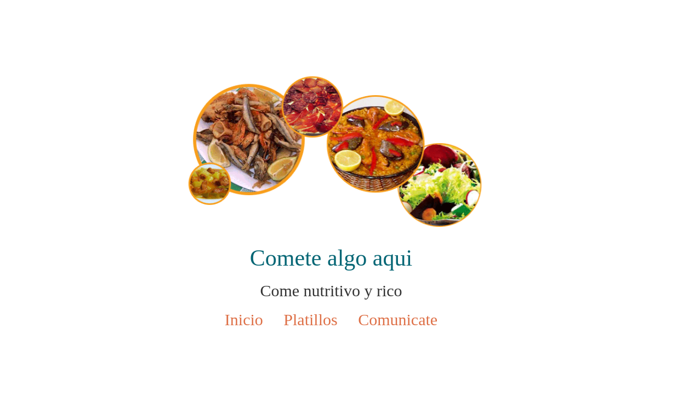

# Plantilla menú

Plantilla realizada mientras tomaba un curso en Youtube en el canal de código facilito.

## Tecnologías

1. HTML5
2. Bootstrap
3. Animate.css
4. CSS3
5. Google fonts
6. Nginx
   
## Échale un vistazo

+ [Docker hub]() - Consulta el repositorio y descárgate el contenedor o simplemente ejecuta la siguiente línea en tu Docker.

`docker run -dp 3030:80 --name presentacion jkarlozdhub/tarjetapresentacion:v1`

+ [Azure web site](https://tarjetapresentacion.azurewebsites.net/) - también puedes ir directo al sitio alojado en Azure